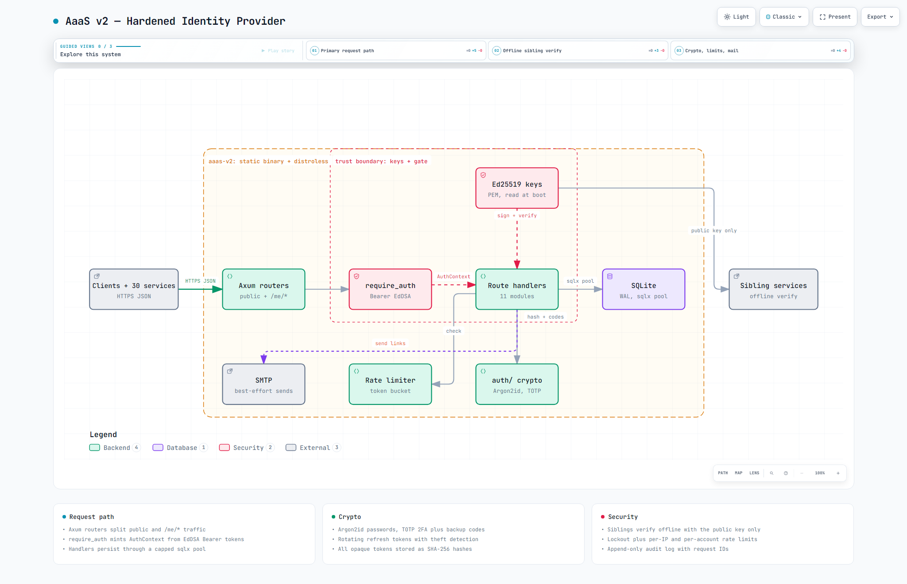

# AaaS v2 — Day 30

[](http://localhost:3000/health) [](https://www.rust-lang.org) [](https://github.com/tokio-rs/axum) [](https://github.com/launchbadge/sqlx) [](https://www.docker.com) [](#testing-curl--local)

**Local:** `http://localhost:3000` — `GET /health` → `{"service":"AaaS v2 — Hardened Identity Provider","version":"2.0.0","status":"ok",...}`

Local-first hardened identity microservice. **Rust + Axum + SQLite**. Capstone rebuild of Day 1's AaaS for the 30 Services challenge.

> **Docs:** [Interactive Architecture](aaas-v2.architecture.html) • [Spec + TDS](AaaS-v2.md) • [Operations](docs/4.%20Deep%20Dive/Operations.md) • [CodeTour](.tours/new-joiner-aaas-v2.tour) • [Sign-off](SIGNOFF.md)

## Architecture — Interactive + Big Preview

[](aaas-v2.architecture.html)

> **Big preview** (2048×1320 light — 185 KB) — click for interactive pan/zoom/trace + light/dark + PNG export. Also available: [dark variant](aaas-v2.architecture.visual-check.2048x1320.dark.png) & [1440×900 light](aaas-v2.architecture.visual-check.1440x900.light.png). Full showcase: 9/9 checks, 0 errors.

## Stack
- **Runtime:** Static Rust binary (6 MB) or 31 MB distroless image
- **Framework:** Axum 0.7 + Tokio (multipart-free JSON API)
- **DB:** SQLite via `sqlx` (WAL + FK, single file, auto-migrated at boot)
- **Hash:** Argon2id (OWASP: 19 MiB, t=2, p=1) + SHA-256 for opaque tokens
- **JWT:** EdDSA Ed25519 — siblings verify **locally** with the public key
- **2FA:** TOTP RFC 6238 (SHA1/6-digit/30s) + 10 single-use backup codes
- **Mail:** `lettre` SMTP, best-effort background sends (off by default locally)

## Project Structure
```
.
├── src/main.rs                  # boot: config → pool → migrate → router → serve
├── src/config.rs                # every knob is an env var (see .env.example)
├── src/error.rs                 # AppError → uniform {"success":false} JSON
├── src/state.rs                 # AppState: pool + config + JWT + limiter
├── src/auth/                    # password | jwt | tokens | totp | lockout (pure, no HTTP/SQL)
├── src/db/                      # users | sessions | tokens (rotation) | audit
├── src/routes/                  # 11 handlers: register/login/refresh/verify/me/...
├── src/middleware/auth.rs       # require_auth (Bearer→AuthContext) + request_id
├── src/ratelimit/               # in-memory token bucket
├── src/email/                   # SMTP sender + HTML templates
├── migrations/0001_init.sql     # 8 tables, applied idempotently at boot
├── secrets/                     # jwt-private.pem + jwt-public.pem (openssl, gitignored)
├── Dockerfile                   # rust:1.98-slim → distroless/cc (no dummy-main hack)
├── docker-compose.yml           # :3000 + /data + /secrets volumes
├── docs/                        # 1. Overview · 2. Architecture · 3. Workflows · 4. Deep Dive
├── .tours/                      # 11-stop CodeTour for new joiners
├── aaas-v2.architecture.html    # interactive diagram (showcase 9/9)
├── AaaS-v2.md                   # TDS v2.0.0 (spec + all source + curl)
├── SIGNOFF.md                   # Day-30 challenge sign-off (30/30)
├── .env.example                 # → .env (local config)
└── README.md
```

## Quick Start (15 mins)

```bash
# 1. Keys (Ed25519 — siblings only ever need the public one)
mkdir -p secrets
openssl genpkey -algorithm Ed25519 -out secrets/jwt-private.pem
openssl pkey -in secrets/jwt-private.pem -pubout -out secrets/jwt-public.pem

# 2. Config (sane local defaults, SMTP off)
cp .env.example .env

# 3. Run (first build compiles deps, ~5 min)
cargo run
# → {"service":"AaaS v2 — Hardened Identity Provider",...} on :3000/health

# 4. Test
cargo test            # 4/4 green

# 5. Or Docker (31 MB, prebuilt path tested with full E2E)
docker compose up --build -d
# Windows Git Bash: use compose (MSYS mangles hand-rolled -v paths)
```

## API

All JSON. Base: `http://localhost:3000` — envelope `{"success":true,...}`; errors `{"success":false,"error":"..."}`

### POST /auth/register
```json
{ "email": "user@example.com", "password": "correct horse battery staple" }
```
`200` → `{ user_id, email, email_verified: false, message }` | `400` bad input | `409` email exists | `429` limited

### POST /auth/email/verify
```json
{ "token": "TOKEN_FROM_EMAIL" }
```
`200` → `{ message: "Email verified." }` | `401` bad/expired/used token

### POST /auth/login
```json
{ "email": "user@example.com", "password": "correct horse battery staple" }
```
`200` → `{ access_token, refresh_token, token_type: "Bearer", expires_in: 900, session_id }` | `401` invalid | `403` unverified/disabled | `423` locked | `requires_2fa: true` + `challenge_token` when TOTP is on

### POST /auth/login/2fa
```json
{ "challenge_token": "CHALLENGE", "code": "123456" }
```
`200` → full session tokens (TOTP code or single-use backup code) | `401` wrong code

### POST /auth/refresh
```json
{ "refresh_token": "<REFRESH>" }
```
`200` → `{ access_token, refresh_token (rotated!), token_type, expires_in }` | `401` invalid/expired — **reusing an old token revokes the whole session (theft signal)**

### GET /auth/verify ⭐ (for other services)
```
Authorization: Bearer <access_token>
```
`200` → `{ valid: true, user_id, session_id, scope, expires_at, issued_at }` | `401` missing/invalid/expired — or verify **offline** with the public key (EdDSA, no round-trip)

### GET /me · PUT /me
```
Authorization: Bearer <ACCESS_TOKEN>
```
`200` → `{ user: { id, email, email_verified, names, totp_enabled, ... } }` | update takes `{ first_name, last_name, display_name, avatar_url, phone }`

### POST /me/password
```json
{ "current_password": "...", "new_password": "new even stronger password" }
```
`200` → all sessions revoked (re-login everywhere) | `401` wrong current password

### POST /me/email
```json
{ "new_email": "new@example.com" }
```
`200` → verification link sent; address swaps only after `/auth/email/verify` | `409` taken

### GET /me/sessions · DELETE /me/sessions/:id
`200` → `{ sessions: [{ id, device_name, ip_address, ... }], current_session_id }` | revoke `200` (`403` not yours)

### POST /me/2fa/enroll → /verify → /disable
enroll `200` → `{ secret, otpauth_url, backup_codes[10] }` (`409` if on) · verify `{ code }` → enabled · disable `{ password }` → off + codes wiped

### GET /me/audit-log
`200` → `{ events: [...] }` (last 100 security events)

### POST /auth/password/reset → /reset/confirm
```json
{ "email": "user@example.com" }
```
Always `200` generic (no email oracle) → confirm `{ token, new_password }` → `200`, all sessions revoked

### POST /auth/logout
```json
{ "all_devices": false }
```
`200` → current session revoked (`true` → count of all revoked)

### GET /health
`200` → `{ service, version: "2.0.0", language: "Rust", status: "ok", features: [...10], timestamp }`

## Testing (cURL) — Local

```bash
BASE="http://localhost:3000"

# register
curl -X POST $BASE/auth/register -H "Content-Type: application/json" \
  -d '{"email":"test@example.com","password":"correct horse battery staple"}'

# verify (SMTP off locally: stage the token via DB, then:)
curl -X POST $BASE/auth/email/verify -H "Content-Type: application/json" \
  -d '{"token":"TOKEN"}'

# login (save access + refresh)
curl -X POST $BASE/auth/login -H "Content-Type: application/json" \
  -d '{"email":"test@example.com","password":"correct horse battery staple"}'

# me + verify
curl $BASE/me -H "Authorization: Bearer <ACCESS>"
curl $BASE/auth/verify -H "Authorization: Bearer <ACCESS>"

# refresh (rotates!) then prove theft detection with the OLD token → 401
curl -X POST $BASE/auth/refresh -H "Content-Type: application/json" \
  -d '{"refresh_token":"<REFRESH>"}'
curl -X POST $BASE/auth/refresh -H "Content-Type: application/json" \
  -d '{"refresh_token":"<OLD_REFRESH>"}'

# 2FA: enroll → scan otpauth_url → verify code → next login returns challenge_token
# logout
curl -X POST $BASE/auth/logout -H "Authorization: Bearer <ACCESS>" \
  -H "Content-Type: application/json" -d '{"all_devices":false}'
```

## Integration (for sibling services)

1. Ship `secrets/jwt-public.pem` to the consumer (it can never mint, only verify)
2. Verify locally with any EdDSA lib (sub-second, no network), checking `iss`/`aud` + `exp`
3. Or `GET http://aaas-v2:3000/auth/verify` with the same `Authorization` header
4. `200` → use `user_id` (+ `session_id`, `scope`) for business logic
5. `401` → return `401 Unauthorized` immediately
6. *Cache* verify results ~60s for high traffic (see spec §10 Dobadoba example)

## Security Notes

- Passwords: Argon2id (OWASP params from env), per-password salt, PHC string in one column
- Refresh: SHA-256 hex, single-use, `replaced_by` chain — reuse = theft → session dies
- Access JWT: EdDSA, 15 min expiry, `sub` + `sid` + `jti` + `scope`
- Reset/verify/email tokens: SHA-256 at rest, single-use, 24 h verify / 1 h reset
- Login: rate-limited per-IP + per-email, dummy-hash on unknown users (no oracle), lockout 5 fails → 15 min (423)
- Reset/resend always 200-generic (no email-enumeration oracle)
- 5xx bodies never leak internals (server-side `tracing::error!` only)

### Ponytail decisions (skipped → when to add)
- No ORM — `sqlx` raw queries are shorter; add when joins get complex
- No migration runner — one split-on-`;` file is enough; add `sqlx::migrate!` past 1 migration
- No Redis for limits — in-memory bucket is one file; add when multi-instance
- No `scratch` image — SQLite needs libc, so distroless/cc; go musl-static if scratch is ever required
- No admin ban/unban endpoints — force-logout is covered by session revoke; add when moderation is needed

## Deploy Checklist

- [ ] `secrets/jwt-*.pem` generated (Ed25519) and mounted read-only
- [ ] `.env` set (`JWT_ISSUER/AUDIENCE`, SMTP, `RL_*` for expected traffic)
- [ ] `migrations/0001_init.sql` applied (automatic at boot — check logs)
- [ ] `cargo build --release` or `docker compose up --build -d` succeeds
- [ ] Test register→verify→login→refresh→theft-401→logout flow
- [ ] Share `jwt-public.pem` with sibling services

## License
MIT — reuse for all 30 services.
