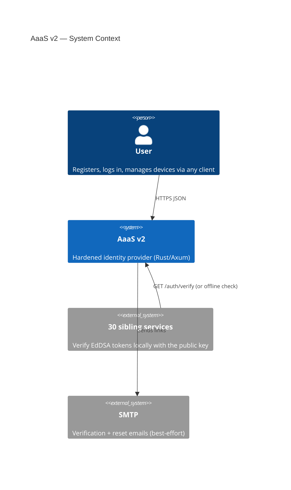
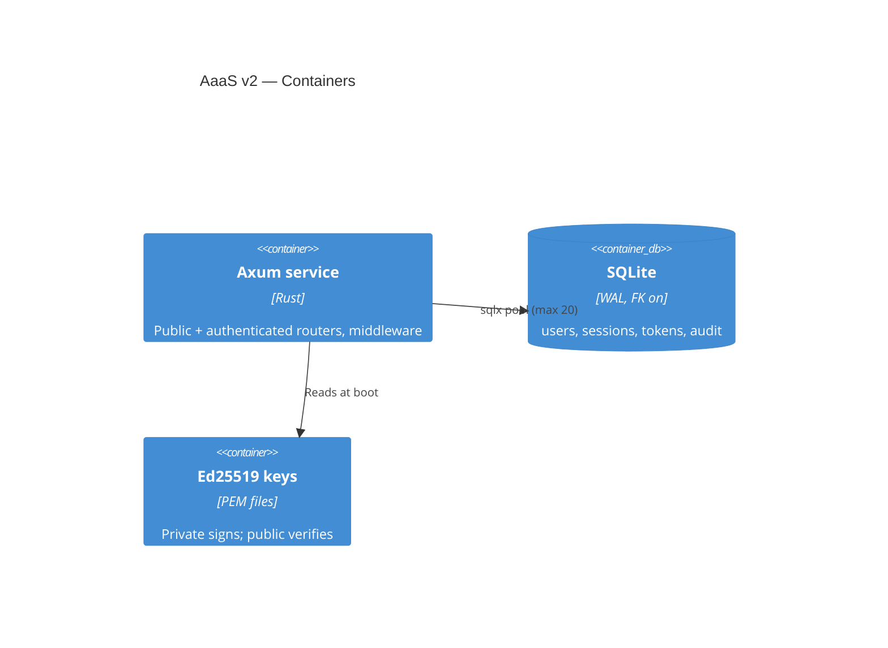
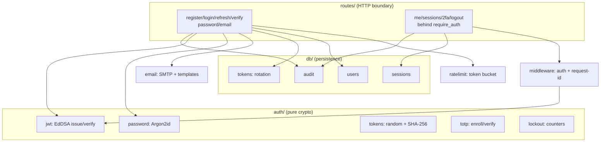

# 2. Architecture Overview

## System context (C4 Level 1)

Key property: access tokens verify **offline** (Ed25519 public key only), so the ecosystem keeps working if AaaS is down, until tokens expire (15 min).

## Containers (C4 Level 2)

Single static binary (~6 MB) + distroless image (~31 MB). No runtime, no shell in the image. Volumes: `/data` (sqlite), `/secrets` (PEM, read-only).

## Components (C4 Level 3)

Dependency rule: `routes → db/auth/*`, `auth/*` never touches HTTP or SQL. `db/tokens.rs` owns the rotation invariant; `middleware/auth.rs` owns the `2fa`-scope rejection (challenge tokens can't hit normal routes).

## Request lifecycle

`request_id` (assign/propagate) → `cors` → router → (`require_auth` for `/me/*`, `/auth/logout`: Bearer → claims → `AuthContext` in extensions) → handler → `AppError` → uniform `{"success": false, "error"}` JSON.

Rate limiting is per-handler (register/login/reset/resend), keyed `action:dimension:value` (e.g. `login:email:<addr>`), 429 + `retry_after_seconds` on breach.

## Data model (essentials)

- `users`: identity + Argon2id hash + lockout counters + TOTP state
- `sessions`: one row per login; `is_revoked` kills its JWTs' usefulness for refresh (access JWTs are stateless, 15-min window)
- `refresh_tokens`: `token_hash / used_at / replaced_by`; reuse of a used token means theft (see §3)
- `email_verification_tokens` / `password_reset_tokens`: hashed, single-use, 24 h / 1 h expiry
- `totp_backup_codes`: individually hashed, one row burns per use
- `audit_log`: append-only, `user_id` nullable (failed logins)
- `rate_limit_state`: schema exists for future persistent buckets (current limiter is in-memory)

Full data-definition language (DDL): `migrations/0001_init.sql`. Applied at boot by splitting on `;` (no migration runner: single static file, applied idempotently).

## Key design decisions

| Decision | Rationale |
|---|---|
| Argon2id over bcrypt/PBKDF2 | Memory-hard; OWASP params from env |
| Ed25519 over HS256 | Asymmetric → offline verification everywhere |
| Rotation + theft detection | Stolen refresh buys the attacker nothing |
| TOTP over SMS | No SIM-swap surface; backup codes cover lockout |
| Password change/reset revokes all sessions | Attacker with the old password loses everything |
| Generic reset/resend responses | No email-enumeration oracle |
| `sid` in JWT + `jti` | Mid-life revocation via session; future revocation lists |
| Distroless + `panic=abort` | 31 MB image, no shell |

## Failure domains

- AaaS down → siblings verify offline until access TTL lapses; logins,
refreshes, resets unavailable (no fallback by design).
- SQLite is single-node: scale reads via sibling-side caching of
`/auth/verify` (60 s TTL, as in the spec's Dobadoba example), not replicas.
- In-memory rate limiter resets on restart (fail-open for availability;
lockout counters persist in the DB).
