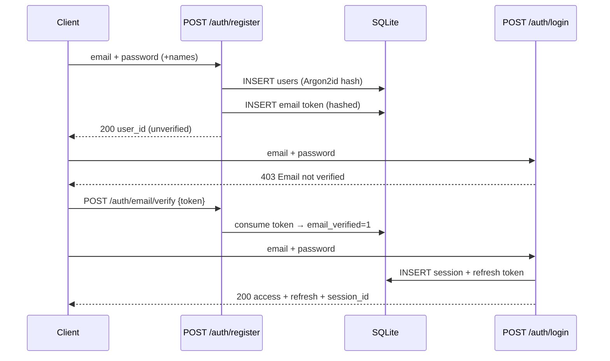
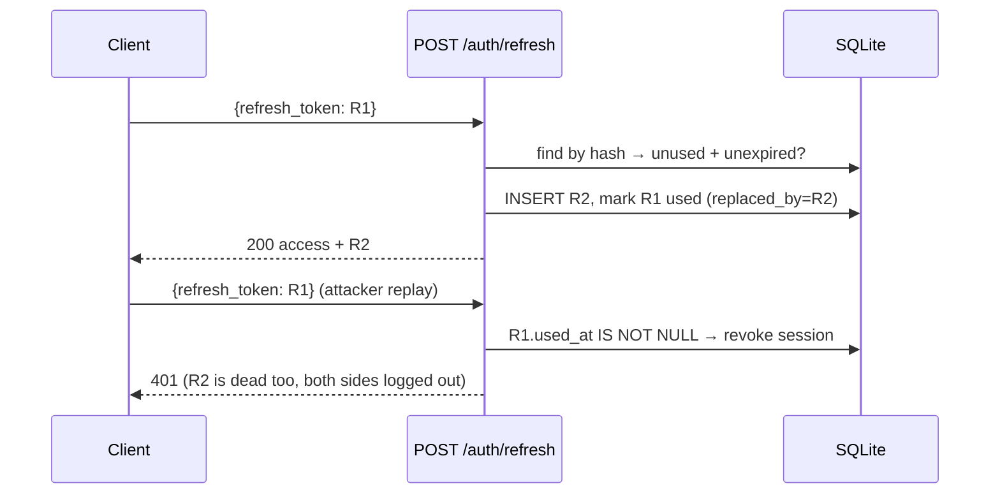
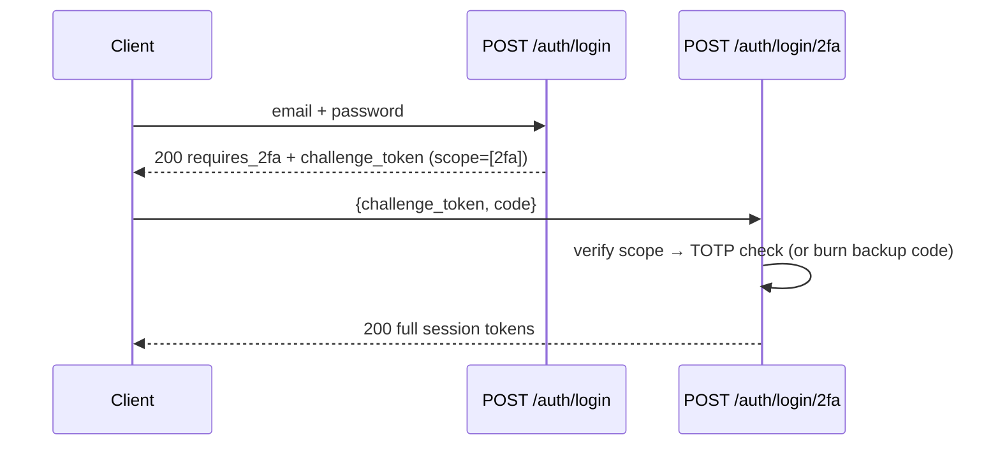

# 3. Workflow Overview

Notation: `→` happy path, `(alt)` branches. Status codes in brackets.

## Register → verify → login



Validation failures → 400; duplicate email → 409; unverified login → 403.

## Refresh rotation + theft detection



## Login with 2FA



Challenge tokens carry `sid=2fa-pending` and are rejected by `require_auth` on normal routes. Wrong code → 401 + `failed_2fa` audit.

## Password reset (no oracle)

Request always returns 200 with the same message, whether or not the email exists. Confirm consumes the single-use 1 h token, updates the Argon2id hash, revokes **all** sessions. Same shape for email-change: new address is stored on the token, applied only after verification.

## Authenticated calls

```
GET /me, PUT /me, POST /me/password, POST /me/email,
GET /me/sessions, DELETE /me/sessions/:id,
POST /me/2fa/{enroll,verify,disable}, GET /me/audit-log,
POST /auth/logout
```

All require `Authorization: Bearer <access>` → `require_auth` → 401 on missing/expired/forged tokens (5 s clock-skew leeway on `exp`).

## Error model

Every failure is `{"success": false, "error": "<msg>"}` with a matching status: 400 validation · 401 credentials/token · 403 locked/unverified · 404 · 409 conflict · 423 locked (account) · 429 + `retry_after_seconds`. 5xx bodies never leak internals (logged server-side with `tracing::error!`).
